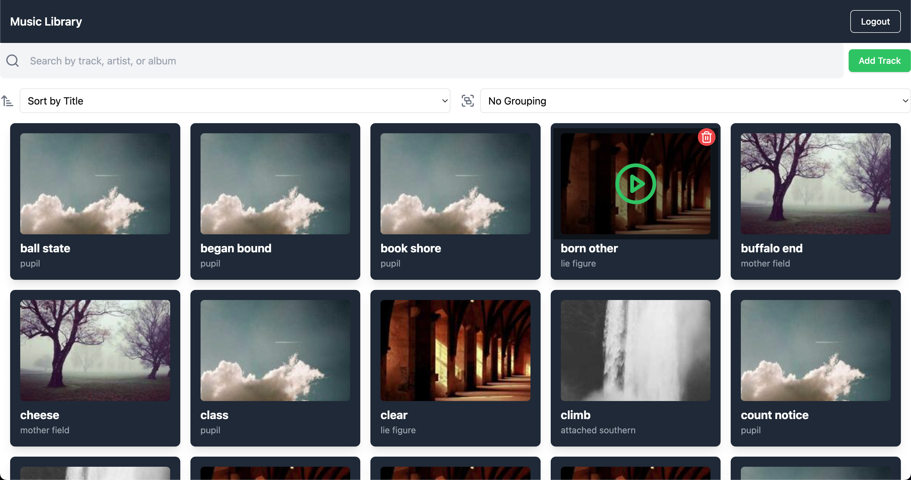

# React Micro-Frontend Demo

This project demonstrates a micro-frontend architecture using React, showcasing how to set up host and remote applications that work together seamlessly.

## Overview

This demo implements a micro-frontend architecture where:
- A host application serves as the main container
- Remote applications can be independently deployed and integrated into the host

## Prerequisites

- Node.js (v14 or higher)
- npm (v6 or higher)

## Getting Started

1. Clone the repository:

```bash
git clone https://github.com/lalithnarayan/microfrontend-finacPlus.git
cd react-microfrontend-demo
```

2. Install dependencies:
```bash
npm run install:deps
```

3. Start the development server:
```bash
npm run preview
```

4. Open your browser and navigate to:
```
http://localhost:4173/
```

## Project Structure

- `host/` - The main container application
- `remote/` - The remote application that gets loaded into the host

## Screenshot




## Features

- Module Federation setup
- Runtime integration of remote components
- Shared dependencies management
- Hot Module Replacement (HMR) support

## Technologies Used

- React
- vite Module Federation
- Vite
- TypeScript (optional)

## Contributing

Contributions are welcome! Please feel free to submit a Pull Request.

## License

This project is licensed under the MIT License - see the LICENSE file for details.
